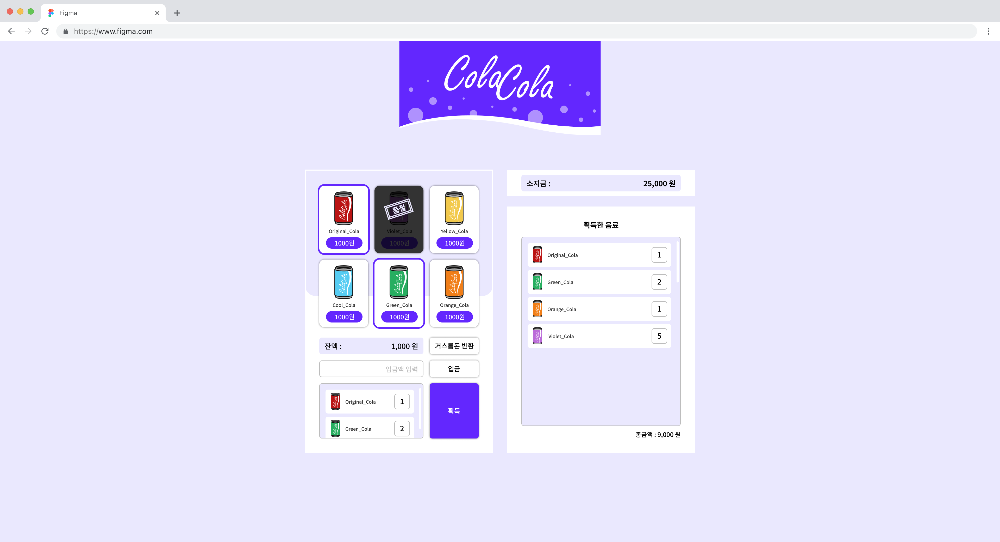
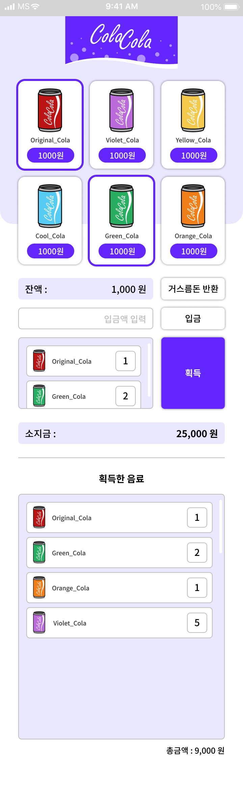

# 무인 자판기

### 사용한 스택 : HTML, CSS, JS

### 난이도 : ⭐⭐⭐

 

## 1. 디자인

- PC 화면

  

 

- 모바일 화면

  

 

## 2. 요구사항 명세

- 판매할 음료에 대한 데이터는 따로 분리되어 있어야 합니다. (혹은 API로 받아야 합니다.)
- 돈의 입금과 음료의 선택 시점은 자유롭지만 돈이 모자라면 음료가 나와서는 안됩니다.
- 거스름돈이 나와야 합니다.
- 버튼을 누르면 상품이 1개씩 추가됩니다. (일반적인 자판기와 동일)
